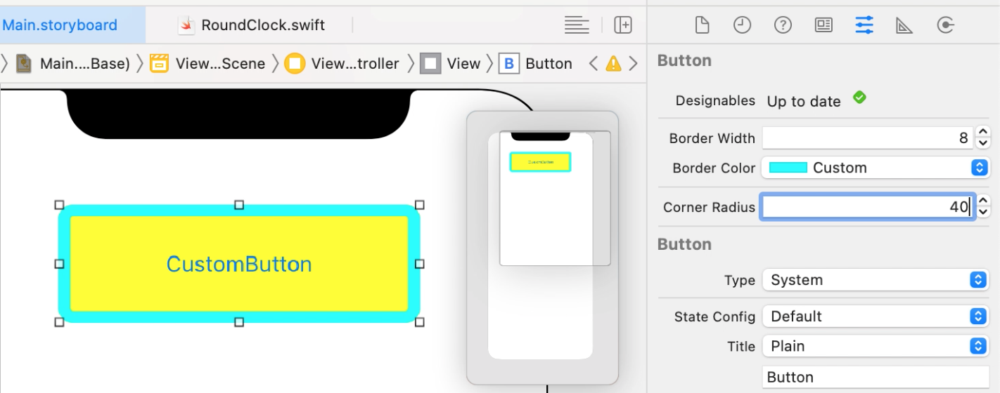
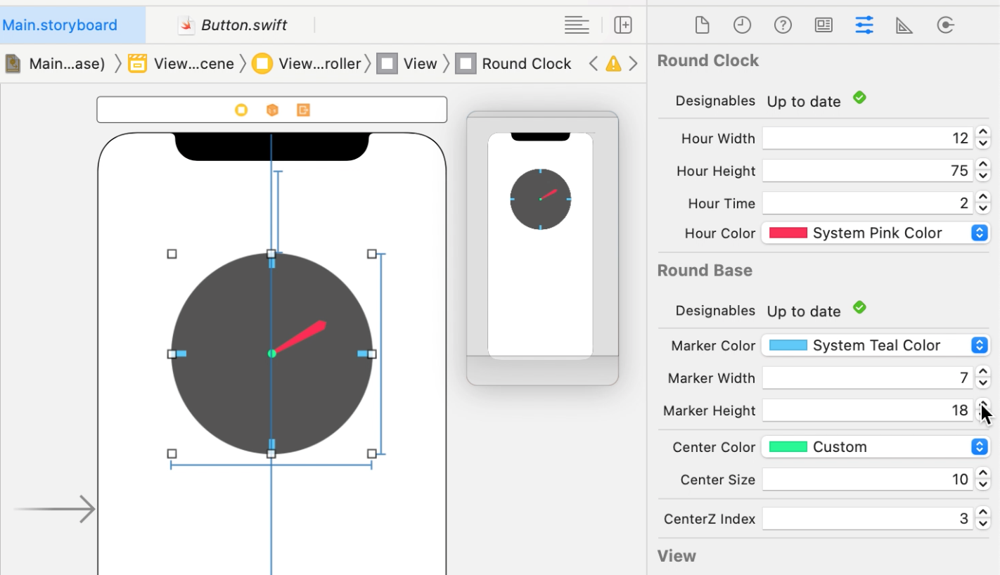
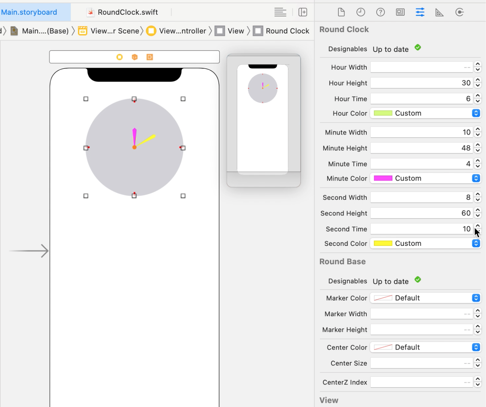
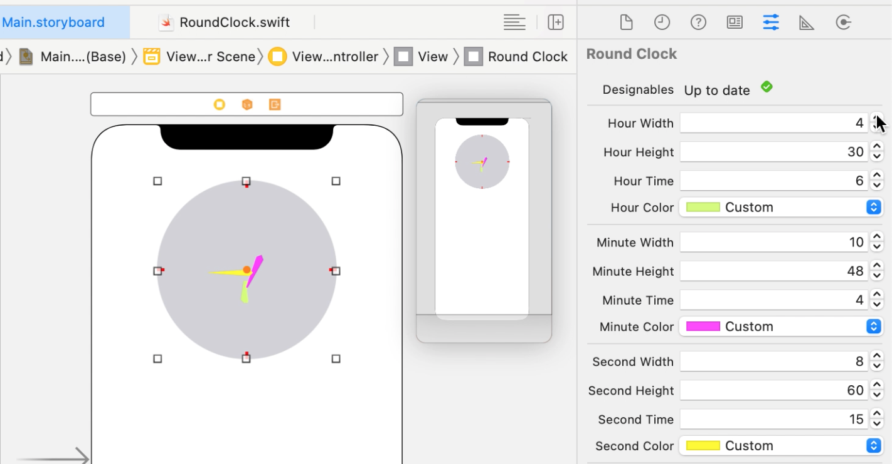
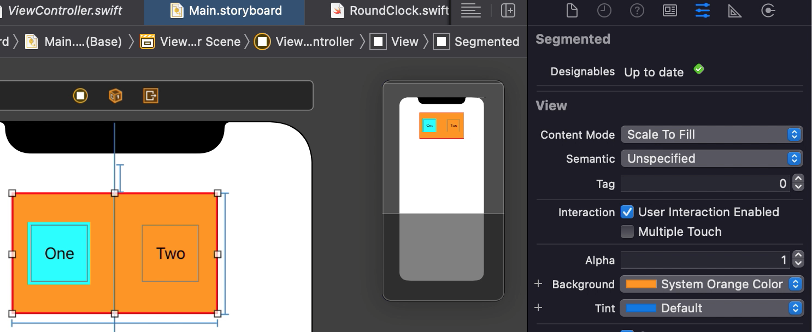

#  Skillbox iOS - 1 level - module 11 
  

### Used equipment and software
  intel core i5, 8GB RAM

  version Big.Sur 11.5.2

  version 12.2

## Target - creation custom `UIView`-components
Usage `@IBDesignable` and `@IBInspectable`

## Custom components
### Button
``` swift
@IBDesignable public class Button: UIButton
```

### Clock
``` swift
@IBDesignable public class RoundBase: UIView
```
``` swift
@IBDesignable public class RoundClock: RoundBase
```
There is also custom arrow class which has been created with help of `CAShapeLayer` and `UIBezierPath`.
``` swift
public class Arrow: UIView
```
>Clock view should has **equal width** and **height** for being round
#### One arrow

#### Three arrows

>There is a bug when all arrows are displayed together, but every arrow work amazing by one


### SegmentedControl
``` swift
@IBDesignable public class Segmented: UIView
```
>There is a bug with displaying setting properties in Interface Builder (for my version XCode and Mac), but **functionality works as expected**.


### Warning
> Theese components aren't displayed expectedly together in Interface Builder. **Add** them into view **by one**.
